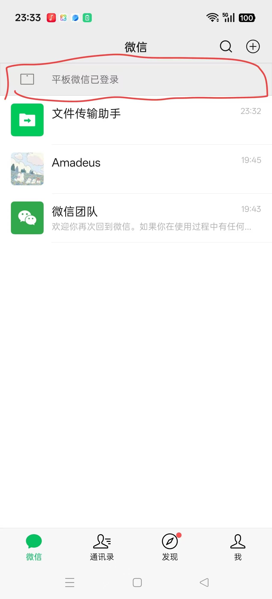
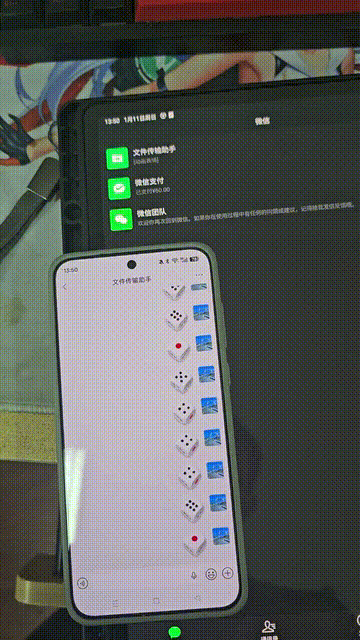
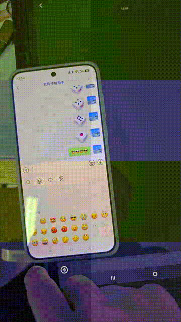
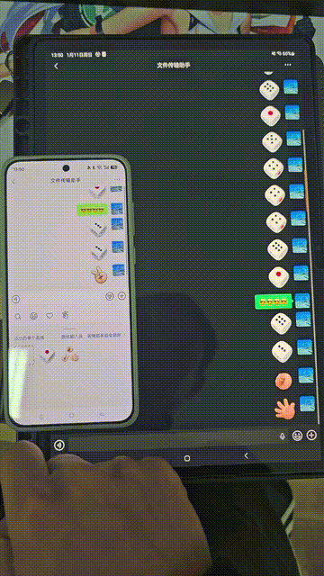
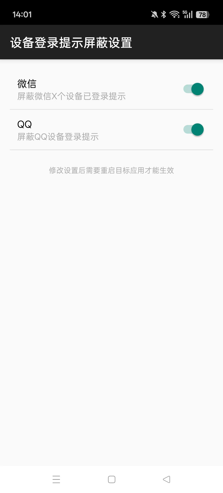

# HideDeviceLoginTip

一个 LSPosed/Xposed 模块，用于隐藏微信和 QQ 的设备登录状态栏提示。

## 功能说明

| 应用 | 隐藏内容 |
|------|----------|
| 微信 | "1个设备已登录微信"、"平板微信已登录"、"Windows微信已登录" 等 |
| QQ | "已登录 Pad"、"已登录 Windows"、"已登录 Windows、Pad" 等 |

**注意**：本模块只隐藏 UI 显示，**不会阻止**扫码登录其他设备的功能。

## 效果展示

### 修改前（原始状态）

### 修改后效果演示

| 演示 1 | 演示 2 | 演示 3 |
|--------|--------|--------|
|  |  |  |

## 下载

| 版本 | 下载 | 更新日期 |
|------|------|----------|
| v1.0.0 | [WQ_hid_v1.0.0.apk](https://github.com/yangchengjun/WX---pad--LSposed/releases/download/v1.0.0/WQ_hid_v1.0.0.apk) | 2026-01-11 |

## 安装使用

### 环境要求
- Android 9.0+ (API 28+)
- LSPosed 或其他 Xposed 框架
- 微信 / QQ 应用

### 安装步骤

#### 第 1 步：下载安装 APK
从上方下载链接获取最新版 APK，安装到手机。

#### 第 2 步：在 LSPosed 中启用模块
打开 LSPosed 管理器 → 模块 → 找到 "HideDeviceLoginTip" → 启用

#### 第 3 步：勾选作用域
勾选需要生效的应用：
- ✅ 微信 (com.tencent.mm)
- ✅ QQ (com.tencent.mobileqq)

#### 第 4 步：打开模块设置

在模块设置中可以单独开启/关闭：
- 微信屏蔽开关
- QQ 屏蔽开关

#### 第 5 步：重启目标应用
**强制停止**微信/QQ，然后重新打开即可生效。

> ⚠️ 必须强制停止，不是直接关闭！

## 技术特点

### 5 重保险机制

本模块采用多层防护策略，确保设备登录提示被完全隐藏：

| 层级 | 策略 | 说明 |
|------|------|------|
| 第 1 层 | 文本替换 | Hook TextView.setText()，检测到目标文本直接替换为空 |
| 第 2 层 | View 隐藏 | 将 TextView 设为 GONE，高度设为 0 |
| 第 3 层 | 父容器隐藏 | 遍历隐藏包含提示的整个父容器 |
| 第 4 层 | 延迟隐藏 | 50ms/100ms/200ms/500ms 多次延迟确保隐藏 |
| 第 5 层 | 源头拦截 | (仅微信) 使用 DexKit 查找并拦截混淆类 |

### 延迟显示说明

由于 Hook 时机原因，状态栏可能会**短暂闪现**（几十毫秒），5个隐藏机制轮流执行以跳过官方检测。这是正常现象，不影响使用效果。

## 测试环境

| 项目 | 信息 |
|------|------|
| 测试机型 | 一加 ACE6 |
| 系统版本 | PLQ110_16.0.2.403 |
| QQ 版本 | V9.2.55.33000 (最新版) |
| 微信版本 | V8.0.65 (最新版) |

> 💡 只要应用的机制不变，理论上向前和向后都能兼容多个版本。

## 常见问题

### Q: 状态栏有时会短暂出现？
A: 这是正常现象，5重保险机制会在几十毫秒内将其隐藏。

### Q: 修改设置后没有生效？
A: 需要**强制停止**并重新打开目标应用，不是直接关闭。

### Q: 会影响扫码登录功能吗？
A: 不会。本模块只隐藏 UI 显示，不影响任何登录功能。

### Q: 新版本微信/QQ 还能用吗？
A: 只要应用的显示机制不变，理论上都能支持。

## 赞助支持

本项目纯属个人爱好开发，如果对您有帮助，欢迎赞助支持！

**赞助多可以考虑更新维护~**

## 免责声明

本项目仅供学习交流使用。使用本模块可能违反相关应用的用户协议，请自行承担风险。

## 致谢

- [YukiHookAPI](https://github.com/HighCapable/YukiHookAPI)
- [DexKit](https://github.com/LuckyPray/DexKit)
- [LSPosed](https://github.com/LSPosed/LSPosed)

## License

本项目采用 [MIT License](LICENSE) 开源协议发布。
